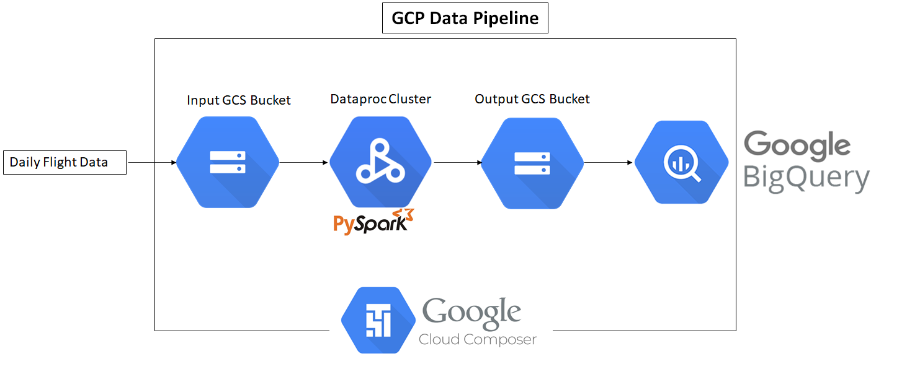

# BigQuery Spark-SQL Batch ETL

## Problem Statement
An Airline company called Spark Airways, recieves JSON flight data on daily basis in its GCS bucket. It contains fields such as id, flight_date, airline_code, flight_num, source_airport, destination_airport, departure_time, departure_delay, arrival_time, arrival_delay, airtime, and distance. Design an ETL pipeline for daily data ingestion of this flight data to produce average flight delays by flight number and distance as tables in BigQuery. 

## Technologies Used
- Spark SQL
- pyspark
- Airflow (Cloud Composer)
- GCS (Google Cloud Storage)
- BigQuery
- Shell

## # Flight Data ETL Pipeline

1. Create BigQuery tables avg_delays_by_flight_nums and avg_delays_by_distance using BQ command shell script. 
2. Create ephemeral Dataproc Cluster.
3. Load daily JSON file as a dataframe in pyspark script (flights-etl.py) and apply transformations to flight delays data using spark-sql to produre output tables.
4. Save the transformed data into GCS output bucket.
5. Load the transformed data from GCS output bucket into Bigquery partitioned tables.
6. Delete ephemeral Dataproc Cluster and transformed output data from GCS output bucket.
7. Use Apache Airflow to create DAGs and automate the Spark ETL batch processing job.

This repository contains scripts for a robust ETL (Extract, Transform, Load) pipeline that integrates flight data processing using Apache Spark, orchestrated with Apache Airflow, and loaded into Google BigQuery for analysis.

## Overview

The `data_pipeline` directory contains Python scripts designed to perform data ingestion from Google Cloud Storage, process the data using Apache Spark, and load the transformed data into Google BigQuery for further analysis. The pipeline is designed to handle and analyze flight delay data efficiently.

### Components

1. **flight_etl.py** - A PySpark script that reads JSON formatted flight data from a specified Google Cloud Storage bucket, processes this data to compute average delays by flight number and by distance categories, and outputs the results back to Google Cloud Storage in a JSON format.

2. **spark_bq_dag.py** - An Apache Airflow DAG script that orchestrates the whole ETL process. It creates a temporary Apache Spark cluster on Google Cloud Dataproc, submits the PySpark job from `flight_etl.py`, loads the processed data into Google BigQuery, and cleans up the environment after execution.

### Key Features

- **Dynamic Processing**: Automatically processes all JSON files within the specified directory of the Google Cloud Storage bucket, making the system adaptable to new data without additional configuration.
- **Scalability**: Utilizes Google Cloud Dataproc to handle data processing, which allows for scaling up or down based on the volume of data.
- **Automation**: Fully automated pipeline orchestrated by Apache Airflow, scheduling runs and handling failures gracefully.
- **Analytics Ready**: Data loaded into Google BigQuery is optimized for analysis, enabling easy integration with BI tools and custom queries.

### Configuration

The scripts use environment-specific configurations which can be adjusted in the script files themselves. Key configurations include the path to the Google Cloud Storage bucket, Google Cloud project details, and Dataproc cluster specifications.

### Prerequisites

To run these scripts, you will need:
- An active Google Cloud account.
- A Google Cloud Storage bucket with flight data files.
- Access to Google Cloud Dataproc and BigQuery services.
- Apache Airflow environment to orchestrate the workflow.

### Setup and Running

1. Clone the repository to your local machine or Cloud Shell.
2. Ensure that your Google Cloud environment variables and service account credentials are correctly set up.
3. Configure the bucket paths and project details in the scripts as per your Google Cloud setup.
4. Deploy the Airflow DAG in your Apache Airflow environment to begin processing.

## Contribution

Contributions are welcome. If you wish to contribute, please fork the repository and submit a pull request.

## License

This project is licensed under the terms of the MIT license.
